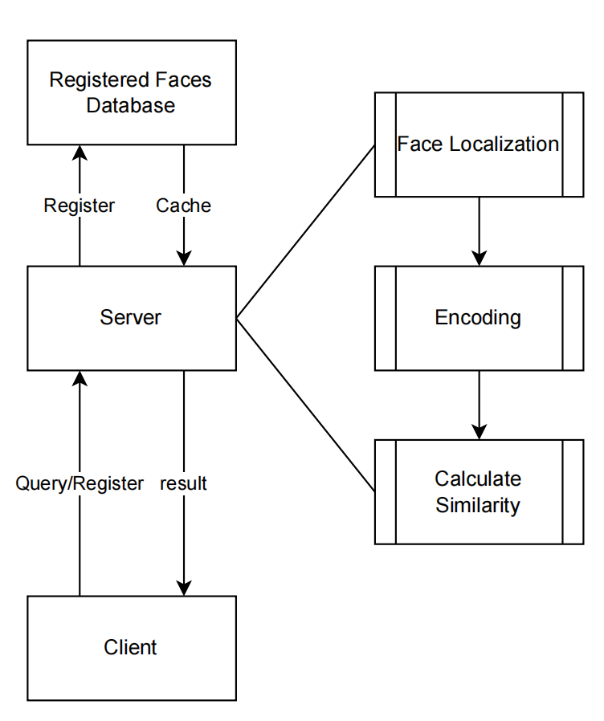

**Face matching and Face Recognition on Website**

Cite from: [DanJun6737/TransFace: Code of TransFace (github.com)](https://github.com/DanJun6737/TransFace)

**Function:**

This code can open a network service on Windows. Users can upload their own face pictures by accessing this port. At the same time, the website supports two functions, registering face pictures and identifying face pictures, using work from Jun Dan and his workmates.

Here is their paper: [[2308.10133\] TransFace: Calibrating Transformer Training for Face Recognition from a Data-Centric Perspective (arxiv.org)](https://arxiv.org/abs/2308.10133)

You can download model from https://drive.google.com/file/d/18Zh_zMlYttKVIGArmDYNEchIvUSH5FQ1/view?usp=share_link

**Structure:**

